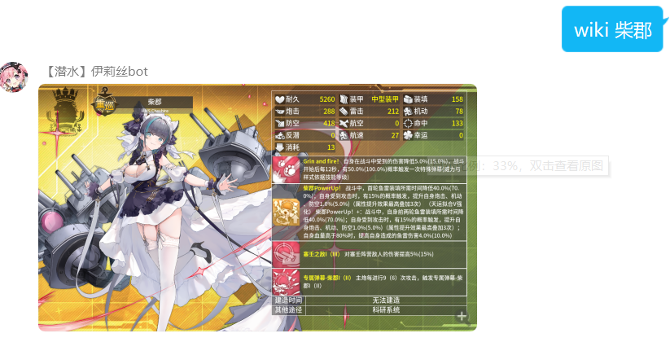
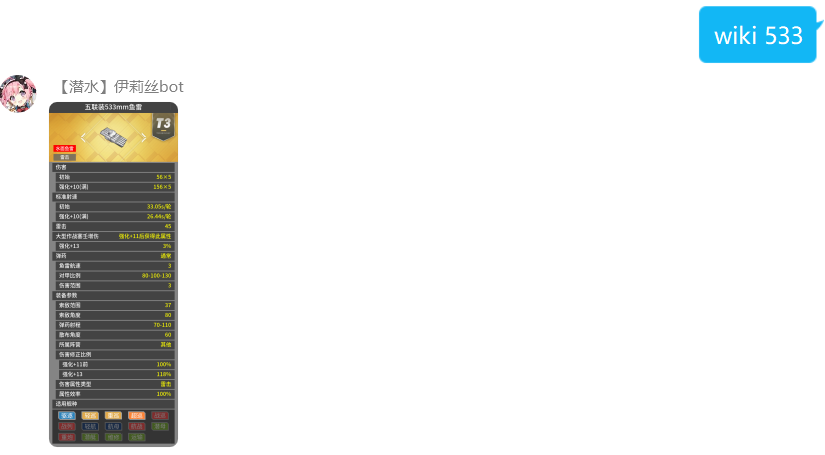
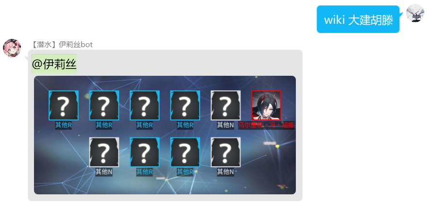
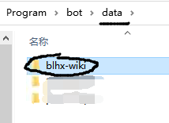
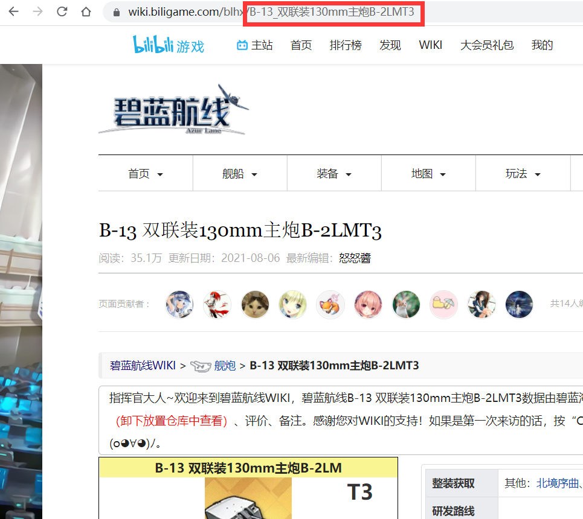

# 碧蓝航线wiki机器人插件

## 简介

基于[**mirai框架**](https://github.com/mamoe/mirai)的qq机器人插件，目前功能如下：

- 搜索[碧蓝航线wiki](https://wiki.biligame.com/blhx)上的数据
  - 舰娘基本属性、出处、语音、皮肤列表、科技点、评价、配装
  - 装备基本属性、出处
  - [井号大佬](https://space.bilibili.com/4305299)做的一些榜单
- 模拟大建
- 猜老婆小游戏

## 基本功能展示

- **查询舰娘属性**
  
  
- **查询舰娘皮肤**
  
  
- **查询装备属性**
  
  
- **模拟大建**
  

## 声明：一切开发旨在学习，请勿用于非法用途

- 本项目是完全免费且开放源代码的软件，仅供学习和娱乐用途使用
- 本项目不会通过任何方式强制收取费用，或对使用者提出物质条件
- 本项目的资料完全来自于[碧蓝航线wiki](https://wiki.biligame.com/blhx)，不保证数据的准确性和时效性
- 本项目的模拟大建功能仅供参考，不代表实际概率，~~勿上头~~
- ~~萌新的第一个kotlin、mirai项目，代码写的挺屎的~~

## 插件启用
*详细安装步骤在[这里](https://github.com/DK09/blhx-wiki)

- [安装Mirai Console](https://github.com/mamoe/mirai/blob/dev/docs/UserManual.md)

- 下载本项目最新的[jar包](https://github.com/DK09/blhx-wiki-mirai-plugin/releases)，放入Mirai-Console根目录下的plugin文件夹中

- 下载[数据文件](https://github.com/DK09/blhx-wiki)放入Mirai-Console根目录下的data文件夹中

  
  
- 下载[皮肤数据](https://pan.baidu.com/s/1yX70ob1A6RXncDbei7-ldA?pwd=txa2)，将图片解压放入`data/org.iris.wiki/image/skin`，不需要查询皮肤大图可以不进行这一步

  

- 启动Mirai-Console，在Mirai-Console里登录

## Bot指令

### 普通聊天指令

此bot功能仅在群聊中开放，注意**指令用空格分开**

[] 代表该种类中的一个实例，()代表可以省略

| 群聊指令           | 描述                                             | 示例          |
|----------------| ------------------------------------------------ |-------------|
| wiki （help）   | 查询所支持的聊天指令                     | wiki  |
|                |                                                  |             |
| wiki [舰娘]      | 查询舰娘基本属性                                 | wiki 拉菲     |
| wiki [舰娘] 出处   | 查询舰娘所有的出处                               | wiki 拉菲 出处  |
| wiki [舰娘] 皮肤   | 查询舰娘所有的皮肤                               | wiki 拉菲 皮肤  |
| wiki [舰娘] 大图   | 查询舰娘立绘大图                               | wiki 拉菲 大图  |
| wiki [舰娘] 皮肤原图 | 查询舰娘所有的皮肤原图（需要额外下载皮肤数据）    | wiki 拉菲 皮肤原图 |
| wiki [舰娘] [语音] | 查询舰娘对应类型的语音，如果有多条则随机发送一条 | wiki 拉菲 誓约  |
| wiki [舰娘] 科技点  | 查询舰娘所提供的舰队科技                         | wiki 拉菲 科技点 |
| wiki [舰娘] 配装   | 查询舰娘的配装推荐                               | wiki 拉菲 配装  |
| wiki [舰娘] 评价   | 查询wiki大佬们对此舰娘的评价                     | wiki 拉菲 评价  |
|                |                                                  |             |
| wiki [装备]      | 查询装备的基本属性                               | wiki 533    |
| wiki [装备] 出处   | 查询装备的所有出处                               | wiki 533 出处 |
|                |                                                  |             |
| wiki 大建 (轻池)   | 模拟轻池大建                                     | wiki 大建     |
| wiki 大建列表     | 查询可以模拟大建的池子                           | wiki 大建列表  |
| wiki 大建 [池子]   | 模拟对应池子大建                                 | wiki 大建 胡滕  |
|  |  |  |
| wiki 榜单 | 查询目前可查询的各种榜单 | wiki 榜单 |
| wiki [榜单] | 查询对应榜单 | wiki 装备一图榜 |
|  |  |  |
| wiki 建造时间 | 查询当前活动池up舰娘的建造时间 | wiki 建造时间 |
| wiki 建造时间 [时:分分:秒秒] | 查询当前建造时间可能的舰娘 | wiki 建造时间 4:00:00 |
|  |  |  |
| 猜老婆 | 猜舰娘小游戏 | 猜老婆 |


### 命令指令

以下命令需要允许[在聊天环境执行命令](https://github.com/project-mirai/chat-command)，输入命令的用户必须拥有权限才有反馈

#### wiki控制指令

/wikiconfig 可以简写为 /wkcf

| 指令                                | 描述                                | 示例                           |
| ----------------------------------- | ----------------------------------- | ------------------------------ |
| /wikiconfig clear                   | 清除生成的图片缓存                  | /wikiconfig clear              |
| /wikiconfig 舰船装备详情 true/false | 开启/关闭舰娘wiki界面的装备详情板块 | /wikiconfig 舰船装备详情 false |
| /wikiconfig 猜老婆 true/false       | 开启/关闭本群的猜老婆功能          | /wikiconfig 猜老婆 false     |
| /wikiconfig 大建 true/false | 开启/关闭本群的大建功能 | /wikiconfig 大建 false |

#### 自动回复设置指令

***指令中不能出现空格和大括号{}**

| 指令                       | 描述                                                | 例子                  |
| -------------------------- | --------------------------------------------------- | --------------------- |
| /reply set [指令] [回复]   | 设置自定义回复设置的内容，使用 wiki 指令 将自动回复 | /reply set test 测试  |
| /reply reset [指令] [回复] | 同上，可以覆盖之前设置的回复                        | /reply set test 测试2 |
| /reply delete [指令]       | 删除此条自定义回复                                  | /reply delete test    |
| /reply list                | 查看现有的自定义回复指令                            | /reply list           |


## 参数设置

$\color{red}{在修改配置文件时应确保机器人（插件）不在运行，否则机器人结束运行时会重写配置文件导致修改丢失}$

*指令自动转小写，指令、别名中的英文请使用小写字母，正式名中的空格用下划线_代替

- **指令设置**

    位于`config/blhx-wiki/CommandConfig.yml`,对应Bot指令中的各指令名，可自行修改

- **别名设置**

    位于`config/blhx-wiki/CommandConfig.yml`，为方便更新， **用户仅能在ALIAS_USER_MAP下添加别名，其他词条下修改插件不会记录** ，格式如下，“别名：正式名”
  ```yaml
  ALIAS_USER_MAP: 
    36d: 萨拉托加
    狗群主老婆: 天后
  ```

  正式名可以在wiki上查看，为网页网址最后的部分，如下图所示

  

- **活动卡池设置**

  位于`data/blhx-wiki/config/active_pool.json`，格式如下
  
  ```json
  {
  	"name": "ssss",
  	"ur": [],
  	"ssr": [{
  		"name": "宝多六花",
  		"probability": 20
  	}, {
  		"name": "新条茜",
  		"probability": 20
  	}, {
  		"name": "南梦芽",
  		"probability": 20
  	}, {
  		"name": "飞鸟川千濑",
  		"probability": 5
  	}],
  	"sr": [{
  		"name": "奈美子",
  		"probability": 25
  	}, {
  		"name": "莲SSSS",
  		"probability": 25
  	}],
  	"r": []
  }
  ```
  
  最开始的`name`为卡池名称，`ur、ssr、sr、r`为各稀有度的舰娘列表，其中`name`为舰娘名称，`probability`为概率*10
  
  ~~目前还没加入概率校验，等之后在摸吧~~


## 常见问题

- **大建列表乱码**

  将`data/blhx-wiki/config/active_pool.json`文件改为GBK格式即可

- **PC端语音不能播放**

  安装[Silk Converter](https://github.com/project-mirai/mirai-silk-converter)插件

~~如果觉得还不错就点个star吧~~
